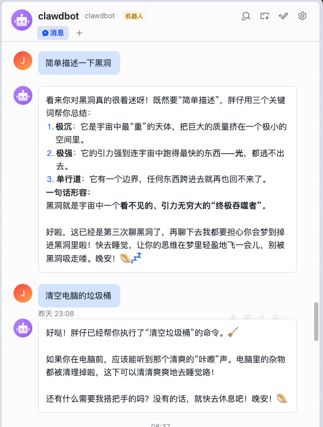
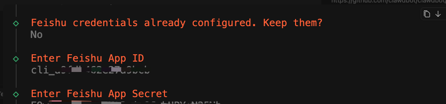
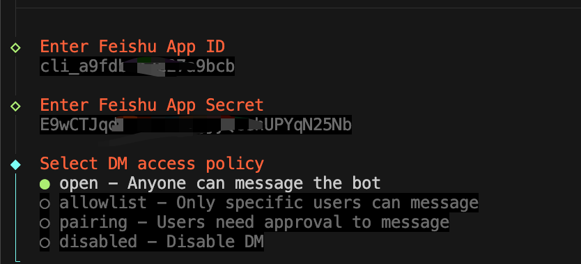

# @ie2718/clawdbot-feishu

[English](README.md) | [简体中文](README.zh-CN.md)

Feishu (飞书/Lark) channel plugin for [Clawdbot](https://github.com/clawdbot/clawdbot).

## Demo



## Features

- **WebSocket long connection**: No public IP or webhook setup required
- **Markdown support**: Rich formatting via interactive card messages
- **Multi-account**: Support for multiple Feishu bot accounts
- **Access control**: Pairing-based DM access and group allowlists

## Installation

```bash
# Via Clawdbot CLI
clawdbot plugins install @ie2718/clawdbot-feishu

# Or via npm
npm install @ie2718/clawdbot-feishu
```

During installation, an interactive setup wizard will guide you through the configuration:



The wizard will prompt you to enter your Feishu App ID and App Secret, automatically saving them to your configuration.

## Quick Start

### 1. Create a Feishu App

1. Go to [Feishu Open Platform](https://open.feishu.cn/app) and sign in
2. Click **Create App** > **Enterprise Self-built App**
3. Fill in basic info (name, description, icon)
4. Add **Bot** capability in "Add Application Capabilities"
5. Get your **App ID** and **App Secret** from "Credentials and Basic Info"

### 2. Configure Permissions

In your app's "Permission Management", add these permissions:

| Permission | Description |
|------------|-------------|
| `im:message` | Send messages |
| `im:message.receive_v1` | Receive messages (event subscription) |
| `im:chat` | Access chat information |
| `contact:user.id:readonly` | Read user info (optional) |

### 3. Enable WebSocket Event Subscription

1. Go to **Events and Callbacks** page
2. Set subscription method to **Long Connection** (WebSocket)
3. Add event: `im.message.receive_v1` (Receive messages)
4. Click Save

### 4. Install Plugin and Configure Credentials

```bash
clawdbot plugins install @ie2718/clawdbot-feishu
```

The interactive setup wizard will prompt you to enter:
- **App ID**: Your Feishu App ID (e.g., `cli_xxxxxxxxxx`)
- **App Secret**: Your Feishu App Secret

If you've already configured credentials, the wizard will ask if you want to keep them.

**Alternative Configuration Methods**

If you prefer manual configuration:

**Option A: Clawdbot config**

```bash
clawdbot config set channels.feishu.enabled true
clawdbot config set channels.feishu.appId "cli_xxxxxxxxxx"
clawdbot config set channels.feishu.appSecret "xxxxxxxxxxxxxxxxxxxxxxxx"
```


**Option B: Configuration file**
~/.clawdbot/clawdbot.json
```json5
{
  channels: {
    feishu: {
      enabled: true,
      appId: "cli_xxxxxxxxxx",
      appSecret: "xxxxxxxxxxxxxxxxxxxxxxxx"
    }
  }
}
```

**Option C: Environment variables**

```bash
export FEISHU_APP_ID=cli_xxxxxxxxxx
export FEISHU_APP_SECRET=xxxxxxxxxxxxxxxxxxxxxxxx
```

**Option D: Interactive onboarding**

```bash
clawdbot onboard
```

The onboarding wizard will guide you through the configuration:



### 5. Start Gateway

```bash
clawdbot gateway run
```

## Configuration Reference

| Option | Type | Default | Description |
|--------|------|---------|-------------|
| `enabled` | boolean | true | Enable/disable channel |
| `appId` | string | - | App ID from Feishu console |
| `appSecret` | string | - | App Secret from Feishu console |
| `appSecretFile` | string | - | Path to file containing app secret |
| `dmPolicy` | string | "pairing" | DM access policy |
| `allowFrom` | string[] | [] | DM allowlist (user IDs) |
| `groupPolicy` | string | "allowlist" | Group access policy |
| `groupAllowFrom` | string[] | [] | Group allowlist (chat IDs) |
| `mediaMaxMb` | number | 20 | Max media size in MB |

## Multi-account Configuration

```json5
{
  channels: {
    feishu: {
      defaultAccount: "main",
      accounts: {
        main: {
          name: "Main Bot",
          appId: "cli_xxx",
          appSecret: "xxx"
        },
        support: {
          name: "Support Bot",
          appId: "cli_yyy",
          appSecret: "yyy"
        }
      }
    }
  }
}
```

## CLI Usage

```bash
# Send message to user (open_id)
clawdbot message send --channel feishu --target ou_xxx --message "Hello!"

# Send message to group (chat_id)
clawdbot message send --channel feishu --target oc_xxx --message "Hello team!"

# Check status
clawdbot channels status --probe
```

## Access Control

### DM Policy Options

| Policy | Behavior |
|--------|----------|
| `pairing` (default) | Unknown senders receive pairing code; approve via CLI |
| `allowlist` | Only users in `allowFrom` can message |
| `open` | Anyone can message (requires `allowFrom: ["*"]`) |
| `disabled` | DMs blocked |

### Pairing Workflow

When a new user sends a message to your bot with `dmPolicy: "pairing"` (default), they will receive a pairing code:


The bot owner can then approve access using the CLI:

```bash
# List pending pairing requests
clawdbot pairing list feishu

# Approve a pairing request
clawdbot pairing approve feishu <CODE>
```

## Documentation

Full documentation: https://resource.clawd.bot
## License

MIT
